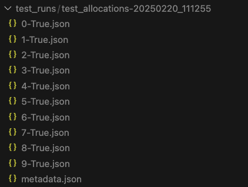
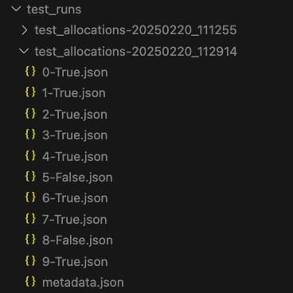

The first step will be just to be able to run the first version of your prompt and see the output in isolation from the rest of your application to have a tight prompt feedback loop.

Imagine we have a python project called `team_recommender` where we recommend teams of developers to be used on a given project. The basic structure looks like this:

team_recommender/
├── README.md
├── requirements.txt
├── src/
│   ├── __init__.py
│   ├── main.py
│   └── utils.py
└── tests/
    ├── fixtures/
    |   ├── example_output.json
    |   └── skills.json
    ├── __init__.py
    ├── test_allocations.py
    └── settings.py


## Single Test
We start running a test prompt inside a pytest to check that the LLM is recommending us developers that we think have relevant skills based off our fixture data:

```python
#test_allocations
import json
import os
from tests.settings import ROOT_DIR
from openai import OpenAI

def get_all_developer_names(skills_data) -> set[str]:
    return {developer["developer"]["name"] for skill in skills_data["skills"] for developer in skill["developerSkills"]}

def test_allocations():
    client = OpenAI()
    assert client is not None
    json_path = os.path.join(ROOT_DIR, "fixtures", "skills.json")
    with open(json_path, "r") as file:
        skills_data = json.load(file)

    json_path = os.path.join(ROOT_DIR, "fixtures", "example_output.json")
    with open(json_path, "r") as file:
        example_output = json.load(file)

    acceptable_people = ["Sam Thomas", "Drew Anderson", "Alex Wilson", "Alex Johnson"]

    system_prompt = f"""
        You will get a description of a project, and your task is to tell me the best developers from the given list for the project
         based on their skills.
        Today's date is April 15th, 2025.
        Pick only developers who are available after the project start date. Pick people with higher skill levels first.
        respond in json with this structure:
            {example_output}

        Here is the skills data:
        """
    system_prompt = system_prompt + str(skills_data)

    project_description = """
        This is a mobile project for telecommunication company. The project starts June 3rd.
        It will find exciting moments from sports highlights videos.
        """
    completion = client.chat.completions.create(
        model="gpt-4o",
        messages=[{"role": "system", "content": system_prompt}, {"role": "user", "content": project_description}],
        response_format={"type": "json_object"},
    )
    response = completion.choices[0].message.content
    person_with_relevant_skill_was_selected = any(name in response for name in acceptable_people)
    assert person_with_relevant_skill_was_selected

```

example_output.json:
```json
{
  "developers": [
    {
      "name": "Bob",
      "availableStartDate": "2025-05-19T00:00:00Z",
      "relevantSkills": [
        {
          "skill": "Javascript",
          "level": "3"
        }
      ]
    },
    {
      "name": "Alice",
      "availableStartDate": "2025-05-19T00:00:00Z",
      "relevantSkills": [
        {
          "skill": "Python",
          "level": "4"
        }
      ]
    }
  ]
}
```

small slice of skills.json:
```json
{
    "skills": [
        {
            "id": 1,
            "name": "Python",
            "developerSkills": [
                {
                    "developerId": 23,
                    "skillId": 1,
                    "skillLevel": 5,
                    "comment": "",
                    "developer": {
                        "id": 23,
                        "email": "jamiemoore@artium.ai",
                        "name": "Jamie Moore",
                        "archivedDate": null
                    }
                }
            ]
        }
    ]
}
```

We run our test and it passes. Huzzah! The LLM has suggested us a name from one of the fixture data entries we think would fit the project. Mission accomplished, right? Not quite. Sometimes when it runs it does not pass. This makes perfect sense, since an LLM is non-deterministic and could be giving different information than we expect or even hallucinating responses. Now that we have our very basic test, what we really want to know is how often it is failing, and it what way.

## Running in a local loop

Running the tests multiple times in a row will allow us to see if a test is returning inconsistent results. We have found that somewhere around `10` times will give you a general idea of how consistent your LLM is running locally with a huge amount of token or time expense. However an issue is that the logs start becoming challenging to read. Let's update our tests to run `10` times in a loop to have a convenient way to see the amount of failures and successes.

```python
# test_allocations.py
import json
import os
from cat_ai.reporter import Reporter
from cat_ai.runner import Runner
from tests.settings import ROOT_DIR
from openai import OpenAI


def test_allocations():
    tries = 10
    skills_json_path = os.path.join(ROOT_DIR, "fixtures", "skills.json")
    with open(skills_json_path, "r") as file:
        skills_data = json.load(file)

    example_json_path = os.path.join(ROOT_DIR, "fixtures", "example_output.json")
    with open(example_json_path, "r") as file:
        example_output = json.load(file)
    system_prompt = f"""
        You will get a description of a project, and your task is to tell me the best developers from the given list for the project
         based on their skills.
        Today's date is April 15th, 2025.
        Pick only developers who are available after the project start date. Pick people with higher skill levels first.
        respond in json with this structure:
            {example_output}

        Here is the skills data:
        """
    system_prompt = system_prompt + str(skills_data)

    project_description = """
    This is a mobile project for telecommunication company. The project starts June 3rd.
    It will find exciting moments from sports highlights videos.
    """
    test_reporter = Reporter(
        "test_allocations",
        metadata={
            "system_prompt": system_prompt,
            "user_prompt": project_description,
        },
        output_dir=ROOT_DIR,
    )
    test_runner = Runner(
        run_allocation_test,
        reporter=test_reporter,
    )
    results = test_runner.run_loop(tries)
    assert False not in results


def run_allocation_test(reporter) -> bool:
    client = OpenAI()
    assert client is not None

    acceptable_people = ["Sam Thomas", "Drew Anderson", "Alex Wilson", "Alex Johnson"]

    completion = client.chat.completions.create(
        model="gpt-4o-mini",
        messages=[
            {"role": "system", "content": reporter.metadata["system_prompt"]},
            {"role": "user", "content": reporter.metadata["user_prompt"]},
        ],
        response_format={"type": "json_object"},
    )
    response = completion.choices[0].message.content
    result = any(name in response for name in acceptable_people)
    try:
        json_object = json.loads(response)
        reporter.report(json_object, {"correct_developer_suggested": result})
    except json.JSONDecodeError as e:
        print(f"JSON Exception: {e}")
    return result

```

After running the test, we see something like this:



Wow! All the tests are passing! That seems suspicious. Let's take a closer look at one of these jsons:

```json
{
    "test_name": "test_allocations",
    "folder_path": "/Users/erikluetkehans/workspace/continuous-alignment-testing/examples/team_recommender/tests/test_runs/test_allocations-20250220_111255",
    "output_file": "0-True.json",
    "metadata_path": "/Users/erikluetkehans/workspace/continuous-alignment-testing/examples/team_recommender/tests/test_runs/test_allocations-20250220_111255/metadata.json",
    "validations": {
        "correct_developer_suggested": true
    },
    "response": {
        "developers": [
            {
                "name": "Sam Thomas",
                "availableStartDate": "2025-06-08T00:00:00Z",
                "relevantSkills": [
                    {
                        "skill": "iOS",
                        "level": "5"
                    }
                ]
            },
            {
                "name": "Alex Smith",
                "availableStartDate": "2025-04-07T00:00:00Z",
                "relevantSkills": [
                    {
                        "skill": "iOS",
                        "level": "5"
                    }
                ]
            },
            {
                "name": "Drew Anderson",
                "availableStartDate": "2025-05-26T00:00:00Z",
                "relevantSkills": [
                    {
                        "skill": "Android",
                        "level": "5"
                    }
                ]
            },
            {
                "name": "Jamie Johnson",
                "availableStartDate": "2025-06-15T00:00:00Z",
                "relevantSkills": [
                    {
                        "skill": "Android",
                        "level": "5"
                    }
                ]
            }
        ]
    }
}
```

O.k! Sam Thomas is one of the developers we are checking for. Wait a minute, who is Alex Smith? If we check our fixture data, we see that there is no Alex Smith. Aha! We have found a hallucination! Let's update our test to screen for hallucinations:

```python
import json
import os
from cat_ai.reporter import Reporter
from cat_ai.runner import Runner
from tests.settings import ROOT_DIR
from openai import OpenAI


def get_all_developer_names(skills_data) -> set[str]:
    return {
        developer["developer"]["name"]
        for skill in skills_data["skills"]
        for developer in skill["developerSkills"]
    }


def get_developer_names_from_response(response) -> set[str]:
    return {developer["name"] for developer in response["developers"]}


def test_allocations():
    tries = 10
    skills_json_path = os.path.join(ROOT_DIR, "fixtures", "skills.json")
    with open(skills_json_path, "r") as file:
        skills_data = json.load(file)

    example_json_path = os.path.join(ROOT_DIR, "fixtures", "example_output.json")
    with open(example_json_path, "r") as file:
        example_output = json.load(file)
    system_prompt = f"""
        You will get a description of a project, and your task is to tell me the best developers from the given list for the project
         based on their skills.
        Today's date is April 15th, 2025.
        Pick only developers who are available after the project start date. Pick people with higher skill levels first.
        respond in json with this structure:
            {example_output}

        Here is the skills data:
        """
    system_prompt = system_prompt + str(skills_data)

    project_description = """
    This is a mobile project for telecommunication company. The project starts June 3rd.
    It will find exciting moments from sports highlights videos.
    """
    test_reporter = Reporter(
        "test_allocations",
        metadata={
            "system_prompt": system_prompt,
            "user_prompt": project_description,
        },
        output_dir=ROOT_DIR,
    )
    test_runner = Runner(
        lambda reporter: run_allocation_test(
            reporter=reporter, skills_data=skills_data
        ),
        reporter=test_reporter,
    )
    results = test_runner.run_loop(tries)
    assert False not in results


def run_allocation_test(reporter, skills_data) -> bool:
    client = OpenAI()
    assert client is not None

    acceptable_people = ["Sam Thomas", "Drew Anderson", "Alex Wilson", "Alex Johnson"]
    all_developers = get_all_developer_names(skills_data)

    completion = client.chat.completions.create(
        model="gpt-4o-mini",
        messages=[
            {"role": "system", "content": reporter.metadata["system_prompt"]},
            {"role": "user", "content": reporter.metadata["user_prompt"]},
        ],
        response_format={"type": "json_object"},
    )
    response = completion.choices[0].message.content
    developer_is_appropriate = any(name in response for name in acceptable_people)
    result = False
    try:
        json_object = json.loads(response)
        developer_names = get_developer_names_from_response(json_object)
        no_developer_name_is_hallucinated = (
            False not in [name in all_developers for name in developer_names],
            (f"Some developer names are invalid: {developer_names}"),
        )

        reporter.report(
            json_object,
            {
                "correct_developer_suggested": developer_is_appropriate,
                "no_developer_name_is_hallucinated": no_developer_name_is_hallucinated,
            },
        )
        result: bool = developer_is_appropriate and no_developer_name_is_hallucinated
    except json.JSONDecodeError as e:
        print(f"JSON Exception: {e}")
    return result
```


Yep. The failure was a name halucination. We have no "Sam Moore" in our fixture data:
```JSON
{
    "test_name": "test_allocations",
    "folder_path": "/Users/erikluetkehans/workspace/continuous-alignment-testing/examples/team_recommender/tests/test_runs/test_allocations-20250220_112914",
    "output_file": "5-False.json",
    "metadata_path": "/Users/erikluetkehans/workspace/continuous-alignment-testing/examples/team_recommender/tests/test_runs/test_allocations-20250220_112914/metadata.json",
    "validations": {
        "correct_developer_suggested": true,
        "no_developer_name_is_hallucinated": false
    },
    "response": {
        "developers": [
            {
                "name": "Sam Thomas",
                "availableStartDate": "2025-06-08T00:00:00Z",
                "relevantSkills": [
                    {
                        "skill": "iOS",
                        "level": "5"
                    }
                ]
            },
            {
                "name": "Alex Anderson",
                "availableStartDate": "2025-04-07T00:00:00Z",
                "relevantSkills": [
                    {
                        "skill": "iOS",
                        "level": "5"
                    }
                ]
            },
            {
                "name": "Sam Moore",
                "availableStartDate": "2025-04-17T00:00:00Z",
                "relevantSkills": [
                    {
                        "skill": "iOS",
                        "level": "3"
                    }
                ]
            },
            {
                "name": "Drew Anderson",
                "availableStartDate": "2025-06-23T00:00:00Z",
                "relevantSkills": [
                    {
                        "skill": "iOS",
                        "level": "2"
                    }
                ]
            }
        ]
    }
}
```


O.k! Great! Lets look at our second failure:

```json
{
    "test_name": "test_allocations",
    "folder_path": "/Users/erikluetkehans/workspace/continuous-alignment-testing/examples/team_recommender/tests/test_runs/test_allocations-20250220_112914",
    "output_file": "8-False.json",
    "metadata_path": "/Users/erikluetkehans/workspace/continuous-alignment-testing/examples/team_recommender/tests/test_runs/test_allocations-20250220_112914/metadata.json",
    "validations": {
        "correct_developer_suggested": false,
        "no_developer_name_is_hallucinated": true
    },
    "response": {
        "developers": []
    }
}
```
WOW! We didn't get any developers at all. Great! We can work with this! From here we can update our prompt to be more reslient. Once we make our updates, we will want to make sure these promblems are decreasing and not not regressing over time. Obviously, that isn't something you would try to control on your local machine, and the amount of test runs to get statisticle confidence about the rates of failure/hallucination are staying low. The best surface to gate and monitor this is going to be in your [Continous Integration](running-in-ci.md).
